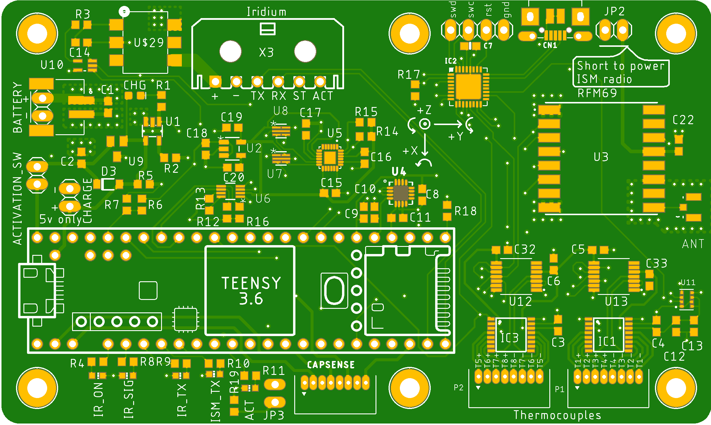

# Kentucky RE-entry Probe Experiment
Board files, schematics, DXF, BOM, partslist and documentation pdf for  KREPE ISS mission hardware. The full flight computer manual can be found here

[Flight Computer Hardware Manual](doc/krepe-flight-computer-manual.pdf).

Often used information is repeated in this document for convenience

### Board renders
<p>

</p>

### Libraries and datasheets for components
- Thermocouple to digital converter
  -  [MAX31856 Library](https://github.com/adafruit/Adafruit_MAX31856)
  -  [MAX31856 Datasheet](https://datasheets.maximintegrated.com/en/ds/MAX31856.pdf)
- Analog Multiplexer
  - [ADG609BRUZ datasheet](https://www.analog.com/media/en/technical-documentation/data-sheets/ADG608_609.pdf)
- Debug Radio
  - [RFM69HCW](https://www.digikey.com/product-detail/en/sparkfun-electronics/COM-13909/1568-1394-ND/6023504)
- 9-axis IMU
  - [DPE Library](https://github.com/drcpattison/DPEng_ICM20948_AK09916)
  - [Sparkfun Library](https://github.com/sparkfun/SparkFun_ICM-20948_ArduinoLibrary)
  - [Datasheet](https://www.invensense.com/wp-content/uploads/2016/06/DS-000189-ICM-20948-v1.3.pdf)
- Solid state relay
  - [Datasheet](https://www.digikey.com/product-detail/en/panasonic-electric-works/AQV252GAX/255-3375-1-ND/2810282)
- High G Accelerometer
  - [Datasheet](https://www.digikey.com/product-detail/en/analog-devices-inc/ADXL377BCPZ-RL7/ADXL377BCPZ-RL7CT-ND/3678489)
- Safety Co-processor
  - [Datasheet](https://www.digikey.com/product-detail/en/microchip-technology/ATSAMD21E16B-MFT/ATSAMD21E16B-MFTCT-ND/5455793)
  - [Arduino variant reference](https://github.com/adafruit/ArduinoCore-samd/blob/master/variants/trinket_m0/variant.cpp)
 
### Teensy pin assignments wrt. to Arduino 


| Teensy Arduino Pin      | Net Name                 | Notes      |
|-------------------------|--------------------------|------------------|
| 0                       | CAPSENSE 1               |  input, read with ```touchRead(pin)```                |
| 1                       | CAPSENSE 0               |  input, read with ```touchRead(pin)```                |
| 3                       | LED IRIDIUM ON           |  active high                |
| 4                       | LED IRIDIUM SIGNAL_OK    |    active high              |
| 5                       | LED IRIDIUM TRANSMITTING |    active high              |
| 6                       | LED ISM TRANSMITTING     |    active high              |
| 7                       | LED ACTIVITY             |    active high              |
| 8			  | CS_DSP		     | active low chip select for DSP310 pressure sensor |
| 9                       | CS_ISM                   |    rfm69 chip select              |
| 11                      | MOSI                     |                  |
| 12                      | MISO                     |                  |
| 13                      | SCLK                     |                  |
| 14                      | BAT_STAT                 |    high when charging              |
| 15                      | CAPSENSE2                |     input, read with ```touchRead(pin)```             |
| 16                      | MUX0                     |    output to analog mux              |
| 17                      | MUX1                     |    output to analog mux              |
| 18                      | SDA                      |                  |
| 19                      | SCL                      |                  |
| 20                      | CS@TC1                   |  U12 chip select                |
| 21                      | CS@TC2                   |  U13 chip select                |
| A8                      | BAT SENSE                | (A8)  halved by voltage divider           |
| 23                      | PRI ACT                  | output to iridium activation 'AND' gate  |
| 24                      | BUZZER                   |     buzzer output             |
| 25                      | TC1 FAULT                | (ACTIVE LOW)     |
| 26                      | TC2 FAULT                | (ACTIVE LOW)     |
| 27                      | SEC CTRL 2               |       i/o to safety processor           |
| 28                      | RESET ISM                |  reset to rfm69                |
| 28                      | INT ISM                  |  interrupt from rfm69                |
| 30                      | CAPSENSE3                |  input, read with ```touchRead(pin)```                |
| 31                      | RIRI                     | (IRIDIUM OUTPUT) |
| 32                      | TIRI                     | (IRIDIUM INPUT)  |
| 33                      | RADIO OFF SIG            | pulled high when 3.3v to ism radio is present                 |
| 34                      | FSYNC                    | IMU sync signal (not necessary for functionality)            |
| 35                      | INT                      | IMU interrupt pin (not necessary for functionality)            |
| 36                      | XOUT                     | (A17)  high g accel output          |
| 37                      | YOUT                     | (A18)  high g accel output          |
| 38                      | ZOUT                     | (A19)  high g accel output          |
| 39                      | SEC CTRL 1               |   i/o to safety processor               |
| A21                     | IRIDIUM TX ACT           |     iridium output indicating the module is actively transmitting RF             |
| A22                     | IRIDIUM STATUS           |  iridium output indicating an SBD message has arrived                |

### Safety processor pin assignments wrt. to Arduino 

The last four pins for the safety processor will need to be added into the board variant file for the trinket m0 since only 5 pins are mapped to physical pads on the current m0 variant.cpp file (or we can make our own arduino board support package ;) )

```SEC CTRL 1``` and ```SEC CTRL 1``` are to be used to coordinate use of the SPI bus so that both the Teensy and safety processor do not drive bus lines to opposite logic levels.


| Safety Processor Arduino Pin|   Net Name                       |                 Note |
|-------------------------|--------------------------|------------------|
| 1                       | CS@TC1                   |    also connected to teensy GPIO              |
| 13                      | CS@TC2                   |    also connected to teensy GPIO              |
| 7                       | SEC ACT                  |     output to activation 'AND' gate             |
| 8                       | SEC CTRL 1               |  i/o with teensy                |
| 0                       | SEC CTRL 2               |  i/o with teensy                |
| PA14                    | TC1 FAULT                |         input        |
| PA15                    | TC2 FAULT                |    input            |
| PA17                    | MUX0                     |       need to use i/o with teensy to avoid collisions on SPI bus           |
| PA18                    | MUX1                     |        need to use i/o with teensy to avoid collisions on SPI bus         |

